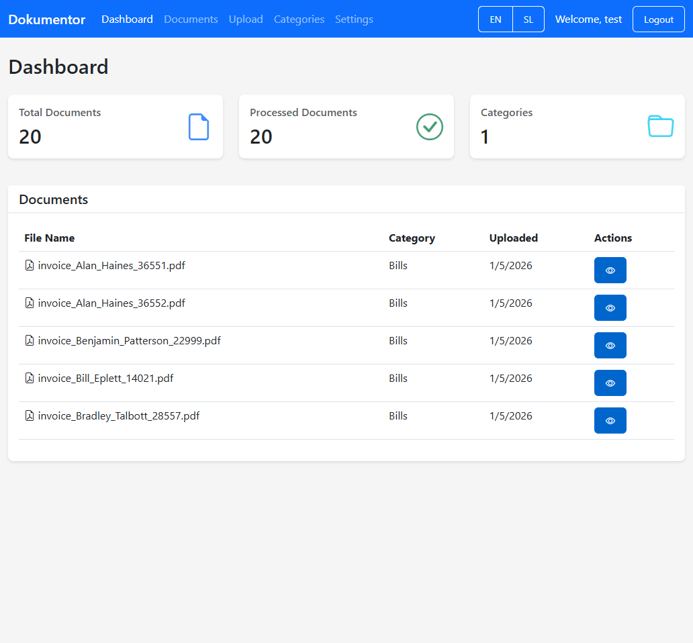
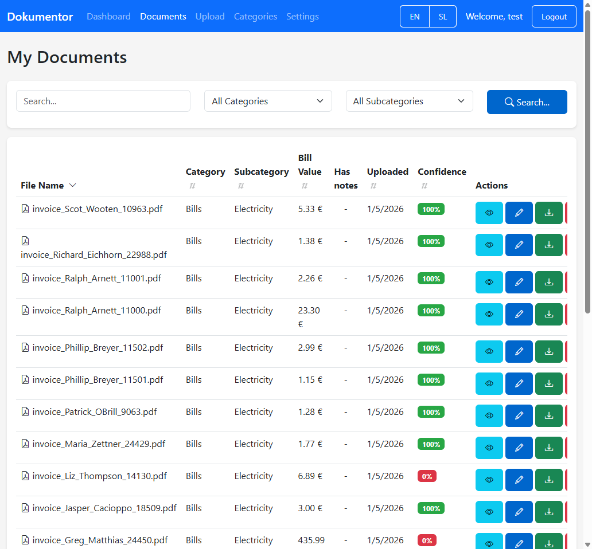
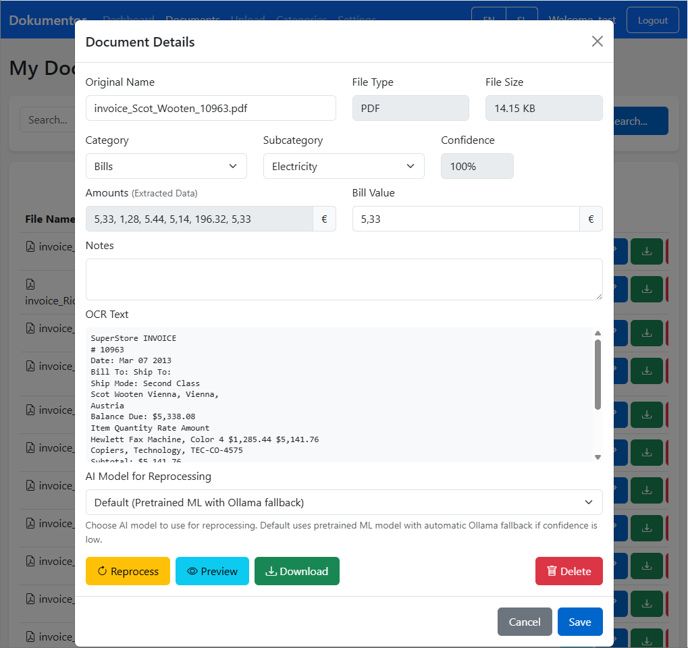
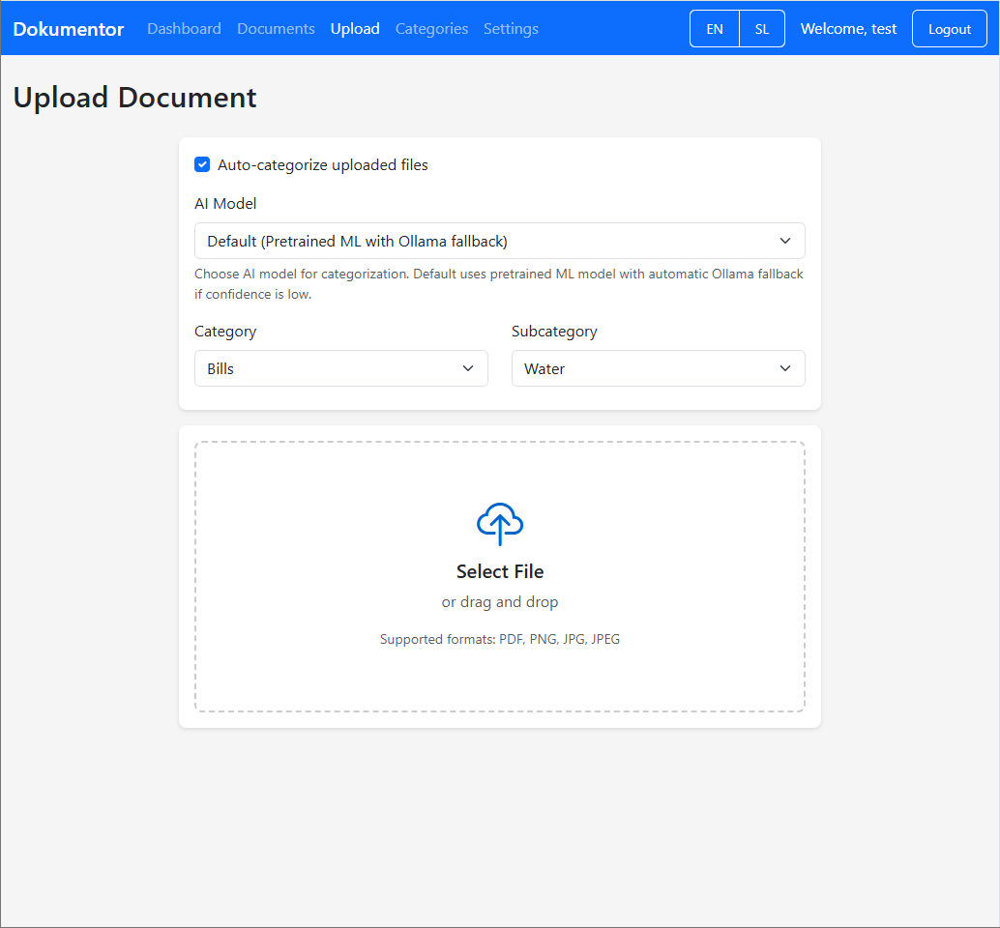
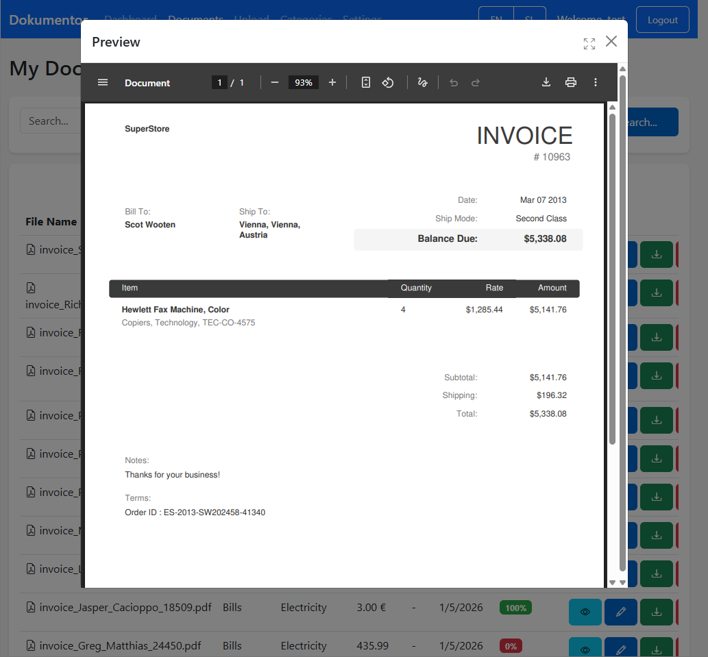
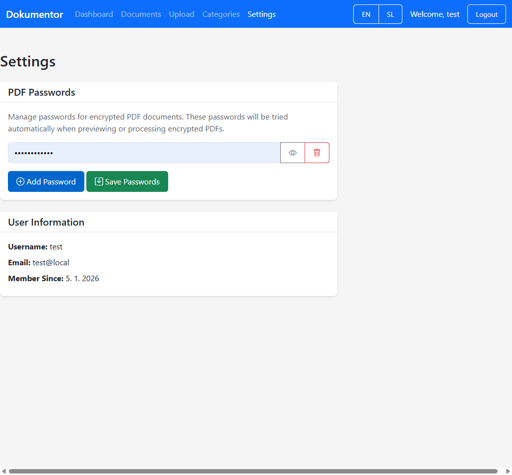
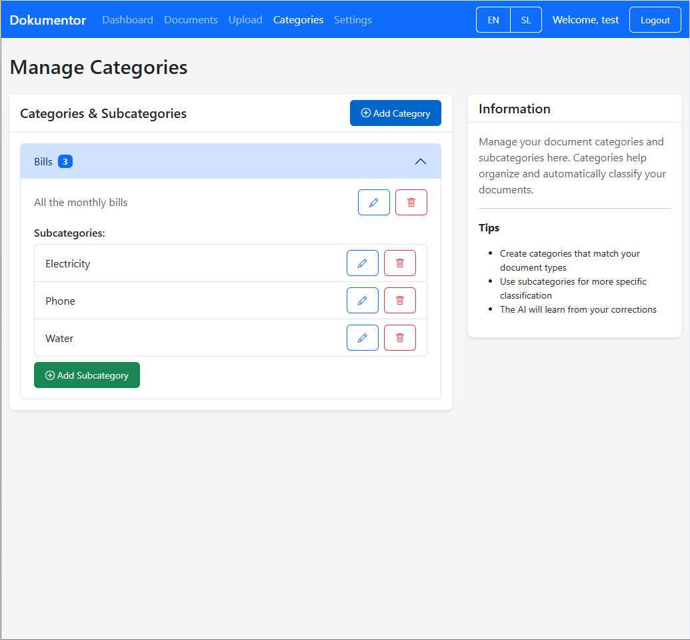
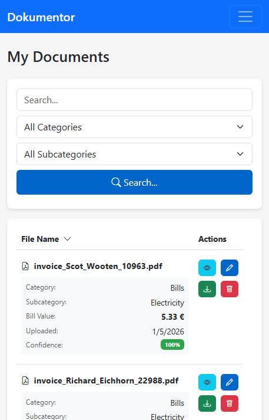
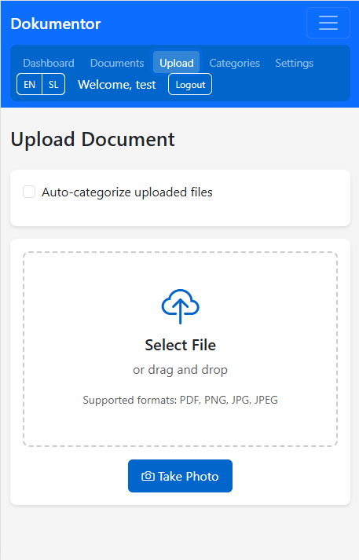

# Dokumentor


A powerful document management system with AI-powered categorization, OCR capabilities, and multi-language support. Perfect for organizing invoices, bills, and other documents automatically.

## ✨ Features

- 📄 **OCR Processing**: Extract text from PDFs and images using Tesseract
- 🤖 **AI Categorization**: Automatically categorize documents with machine learning
- 🔐 **User Authentication**: Secure login and registration system
- 🌍 **Multi-language**: English and Slovenian interface (easily extensible)
- 📱 **Mobile Friendly**: Responsive design with camera capture support
- 📂 **Watch Folder**: Automatically process documents from a monitored folder
- 🔒 **PDF Decryption**: Handle password-protected PDFs
- 📊 **Dashboard**: View statistics and recent documents
- 🏷️ **Categories**: Organize with main categories and subcategories
- 🎓 **Learning AI**: Improves categorization based on user corrections
- 🐳 **Docker Ready**: Easy deployment with Docker Compose
- 📱 **PWA Support**: Install as a Progressive Web App on mobile devices

## 🚀 Quick Start

### Using Docker Compose (Recommended)

1. **Clone the repository**
```bash
git clone https://github.com/thehijacker/dokumentor.git
cd dokumentor
```

2. **Configure environment variables**
```bash
cp .env.example .env
# Edit .env with your settings
```

3. **Start the application**
```bash
# For development (local):
docker-compose up -d

# For production (recommended):
# Use the production compose file which configures services and environment for production
docker-compose -f docker-compose-prod.yml up -d
```

4. **Access the application**
```
http://localhost:5000
```

### Manual Installation

#### Prerequisites
- Python 3.11+
- Tesseract OCR
- Poppler (for PDF processing)

#### Windows Installation

1. **Install Tesseract OCR**
   - Download from: https://github.com/UB-Mannheim/tesseract/wiki
   - Install to default location or update `config.yaml`
   - Install language packs: English and Slovenian

2. **Install Poppler**
   - Download from: https://github.com/oschwartz10612/poppler-windows/releases/
   - Extract and add `bin` folder to PATH

3. **DOCX support (optional)**
   - `python-docx` is used to extract text from `.docx` files (installed via `requirements.txt`). Legacy `.doc` is not supported.

3. **Install Python dependencies**
```powershell
python -m venv venv
.\venv\Scripts\activate
pip install -r requirements.txt
```
4. **Run the application**
```powershell
python app.py
```

#### Linux Installation

```bash
# Install system dependencies
sudo apt-get update
sudo apt-get install -y tesseract-ocr tesseract-ocr-eng tesseract-ocr-slv poppler-utils

# Install Python dependencies
python3 -m venv venv
source venv/bin/activate
pip install -r requirements.txt

# Run the application
python app.py
```

## ⚙️ Configuration

### Configuration File (`config.yaml`)

```yaml
app:
  secret_key: "your-secret-key-here"
  
database:
  path: "./data/documents.db"

storage:
  documents_path: "./documents"
  watch_folder: "./watch_folder"

auth:
  enable_registration: true

ocr:
  default_languages: ["eng", "slv"]

pdf:
  decrypt_passwords:
    - ""
    - "password"
    - "123456"

ai:
  provider: "internal"  # Options: internal, openai, ollama
  model: "simple"
```

### Environment Variables

Override configuration with environment variables:

```bash
# Application
APP_SECRET_KEY=your-secret-key
APP_DEBUG=false

# Database
DATABASE_PATH=./data/documents.db

# Storage
DOCUMENTS_PATH=./documents
WATCH_FOLDER=./watch_folder

# Authentication
ENABLE_REGISTRATION=true

# OCR
OCR_DEFAULT_LANGUAGES=eng,slv

# PDF
PDF_DECRYPT_PASSWORDS=,password,123456

# AI Provider
AI_PROVIDER=internal  # internal, openai, ollama
AI_MODEL=simple
OPENAI_API_KEY=your-openai-key
OLLAMA_URL=http://localhost:11434
OLLAMA_MODEL=llama2  # Model identifier to request from Ollama (optional)
```

Note: `OLLAMA_MODEL` is optional and only used when `AI_PROVIDER` is set to `ollama`. The application reads `ai.ollama_model` from `config.yaml` by default but you can override it with the `OLLAMA_MODEL` environment variable when running in Docker or other environments.

App debug, secure cookies and categories notes:
- `APP_DEBUG` controls Flask's debug mode and SQLAlchemy echo (`app.debug`). It is used at runtime (in `app.py` and `backend/database.py`) so removing it will remove the ability to enable debug/SQL echo via environment variables; keep it if you want quick dev toggling.
- `APP_SECURE_COOKIES` controls whether Flask will set the `Secure` flag on session and remember cookies. Default is `true` (recommended for production). Set it to `false` for local HTTP development/testing (e.g., `APP_SECURE_COOKIES=false`), but do **not** use `false` in production since cookies may be sent over insecure connections.
- Categories: By default the application does not create categories automatically. If you previously relied on predefined categories in `config.yaml`, note that this is disabled by default now. To enable automatic creation, set `categories.initialize_predefined: true` and provide `categories.predefined` entries in `config.yaml`, otherwise users can add categories manually via the UI.

### Generating APP_SECRET_KEY

If you don't already have a secure application secret, generate one and set it in the `.env` file as `APP_SECRET_KEY` (or `app.secret_key` in `config.yaml`).

Examples:

- Linux / macOS / WSL:
```bash
python -c "import secrets; print(secrets.token_urlsafe(32))"
```

- Windows (PowerShell):
```powershell
python -c "import secrets; print(secrets.token_urlsafe(32))"
```

After generating, set `APP_SECRET_KEY` in `.env` or `app.secret_key` in `config.yaml` and do not commit it to source control.

## � Screenshots

A quick visual overview of the application UI:

<table>
<tr>
<td align="center"><br><strong>Dashboard</strong></td>
<td align="center"><br><strong>Documents</strong></td>
<td align="center"><br><strong>Document Details</strong></td>
</tr>
<tr>
<td align="center"><br><strong>Upload</strong></td>
<td align="center"><br><strong>Preview</strong></td>
<td align="center"><br><strong>Settings</strong></td>
</tr>
<tr>
<td align="center"><br><strong>Categories</strong></td>
<td><br><strong>Mobile documents view</strong></td>
<td><br><strong>Mobile document upload</strong></td>
</tr>
</table>

## �📋 Usage

### First Time Setup

1. **Access the application** at `http://localhost:5000`
2. **Register a new account** (if registration is enabled)
3. **Login** with your credentials
4. **Upload your first document** using the Upload section

### Uploading Documents

**Web Interface:**
- Click "Upload" in navigation
- Drag and drop files or click to select
- Supported formats: PDF, DOCX, PNG, JPG, JPEG, TIFF, BMP

**Mobile Device:**
- Click "Take Photo" to capture documents with camera
- Or select from gallery

**Watch Folder:**
- Copy files to the watch folder (default: `./watch_folder`)
- Files are automatically processed

### Language Detection

Documents can specify language in the filename:
- `invoice_en.pdf` - Process with English
- `racun_sl.pdf` - Process with Slovenian

### Categories

**Default Categories:**
- Monthly Costs (Power Bill, Water Bill, Internet, etc.)
- Shops (IKEA, Lidl, Mercator, etc.)
- Medical (Prescriptions, Doctor Visits, Hospital)
- Automotive (Fuel, Maintenance, Insurance)
- Other (Miscellaneous)

**Custom Categories:**
Add custom categories through the database or extend the configuration.

If you want the app to create predefined categories automatically, set in `config.yaml`:

```yaml
categories:
  initialize_predefined: true
  predefined:
    - name: "Monthly Costs"
      subcategories: ["Power Bill", "Water Bill", ...]
    ...
```

Then run the app (or reinitialize DB) and the categories will be created when `init_db()` runs and finds no existing categories.

### AI Learning

**How the AI Learning Works:**

The system uses a **hybrid approach** that evolves as you use it:

**Phase 1: Initial Keyword Matching (0-90% confidence)**
- When you first start, the AI uses simple keyword patterns
- Looks for terms like "electricity", "doctor", "fuel", etc.
- Provides low confidence (usually 30-60%)
- This is why your first uploads show 0% - keywords might not match

**Phase 2: Learning Mode (After corrections)**
The AI learns when you:
1. Upload a document
2. **View** the document (click View button)
3. **Change the category** to the correct one
4. Click **"Save Changes"** (this triggers learning!)

What happens:
- Your correction is saved to the learning database
- System records: document text + correct category
- Every 10 corrections, the AI automatically retrains

**Phase 3: Machine Learning Mode (After 10+ corrections)**
- After 10 corrections per category, AI builds a statistical model
- Uses TF-IDF (text analysis) + Naive Bayes classifier
- Confidence scores become much more accurate (70-95%)
- Learns document patterns specific to your workflow

**Training Progress:**
```bash
# Check learning records in database
sqlite3 data/documents.db "SELECT COUNT(*) FROM learning_records;"

# View what the AI has learned
sqlite3 data/documents.db "SELECT category_id, COUNT(*) FROM learning_records GROUP BY category_id;"
```

**Quick Training Tips:**
- Upload 10-15 documents from each category
- Manually correct ANY wrong categorizations
- After ~30 total corrections, the AI becomes quite smart
- The model file is saved in `./data/models/category_model.pkl`

**Manual Retrain Script**
If you need to retrain models on demand, use the provided script `scripts/retrain_all_users.py`.

```bash
# Retrain all users (inside container)
docker compose exec dokumentor python scripts/retrain_all_users.py

# Retrain a single user
docker compose exec dokumentor python scripts/retrain_all_users.py --user 123

# Dry-run

docker compose exec dokumentor python scripts/retrain_all_users.py --dry-run
```

You can schedule this script with cron (example runs hourly):

```cron
0 * * * * docker compose -f /path/to/repo/docker-compose.yml exec dokumentor python /app/scripts/retrain_all_users.py --min-records 3 >> /var/log/retrain.log 2>&1
```

**Debugging Low Confidence:**
If documents show 0% confidence:
1. Check logs: `docker compose logs | grep "categorization"`
2. Verify OCR extracted text (might be empty)
3. Try documents with clear text/keywords
4. Build up the learning database with corrections

## 🤖 AI Providers

### Internal (Default)
- Uses scikit-learn for categorization
- No external API required
- Trains on your data
- Good for privacy and offline use

### OpenAI
```yaml
ai:
  provider: "openai"
  openai_api_key: "your-api-key"
  openai_model: "gpt-3.5-turbo"
```

### Ollama (Local LLM)
```yaml
ai:
  provider: "ollama"
  ollama_url: "http://localhost:11434"
  ollama_model: "llama2"
```

## 📁 Project Structure

```
dokumentor/
├── app.py                  # Main Flask application
├── config.yaml             # Configuration file
├── requirements.txt        # Python dependencies
├── Dockerfile             # Docker configuration
├── docker-compose.yml     # Docker Compose configuration
├── backend/
│   ├── __init__.py
│   ├── config.py          # Configuration manager
│   ├── database.py        # Database models
│   ├── ocr_processor.py   # OCR handling
│   ├── ai_processor.py    # AI categorization
│   ├── document_processor.py  # Main processing logic
│   └── watch_folder.py    # Watch folder service
├── templates/
│   ├── base.html          # Base template
│   ├── login.html         # Login page
│   ├── register.html      # Registration page
│   └── index.html         # Main application
├── static/
│   ├── css/
│   │   └── style.css      # Custom styles
│   ├── js/
│   │   ├── app.js         # Core app logic
│   │   └── main.js        # UI interactions
│   ├── manifest.json      # PWA manifest
│   └── sw.js              # Service worker
├── data/                  # Database and models (created at runtime)
├── documents/             # Stored documents (created at runtime)
├── watch_folder/          # Watch folder (created at runtime)
└── logs/                  # Application logs (created at runtime)
```

## 🔌 API Endpoints

### Authentication
- `POST /api/auth/login` - User login
- `POST /api/auth/register` - User registration
- `POST /api/auth/logout` - User logout
- `GET /api/auth/me` - Get current user

### Documents
- `GET /api/documents` - List documents (with pagination and filters)
- `GET /api/documents/<id>` - Get document details
- `POST /api/documents/upload` - Upload document
- `PUT /api/documents/<id>/update` - Update document
- `POST /api/documents/<id>/reprocess` - Reprocess document
- `DELETE /api/documents/<id>/delete` - Delete document
- `GET /api/documents/<id>/download` - Download document

### Categories
- `GET /api/categories` - List all categories
- `GET /api/categories/<id>/subcategories` - Get subcategories

### Stats
- `GET /api/stats` - Get user statistics

## 🐳 Docker Deployment

### Build and Run

```bash
# Build image
docker build -t document-manager .

# Run container
docker run -d \
  -p 5000:5000 \
  -v $(pwd)/data:/app/data \
  -v $(pwd)/documents:/app/documents \
  -v $(pwd)/watch_folder:/app/watch_folder \
  -e APP_SECRET_KEY=your-secret-key \
  document-manager
```

### Docker Compose

```bash
# Start services
docker-compose up -d

# View logs
docker-compose logs -f

# Stop services
docker-compose down

# Rebuild after changes
docker-compose up -d --build
```

### Docker Environment Variables

All configuration options can be set via environment variables in `docker-compose.yml` or `.env` file.

## 🔁 CI / GitHub Actions

A GitHub Actions workflow is included to build Docker images on push and on release and (optionally) publish to GitHub Container Registry (GHCR).

- To enable image publishing, ensure the repository `GITHUB_TOKEN` has `packages: write` permission or configure a personal access token (PAT) with `write:packages` and add it to repository secrets (e.g. `GHCR_TOKEN`).
- The workflow uses Docker Buildx and pushes to `ghcr.io/${{ github.repository }}` when a push to `main` occurs or when a release is published.

You can build locally with:
```bash
docker build -t document-manager .
```

And push to GHCR manually (example):
```bash
docker tag document-manager ghcr.io/OWNER/REPO:latest
docker push ghcr.io/OWNER/REPO:latest
```


## 🔧 Development

### Running Tests

```bash
# Install dev dependencies
pip install pytest pytest-cov

# Run tests
pytest

# With coverage
pytest --cov=backend
```

### Code Style

```bash
# Install formatters
pip install black flake8

# Format code
black .

# Lint code
flake8 backend/
```

## 🌐 Multi-language Support

### Adding a New Language

1. **Edit `static/js/app.js`**
2. **Add translations to the `translations` object**

```javascript
const translations = {
    en: { /* English translations */ },
    sl: { /* Slovenian translations */ },
    de: { /* German translations */ }
};
```

3. **Update language detection**
```javascript
return ['en', 'sl', 'de'].includes(shortLang) ? shortLang : 'en';
```

## 📱 Progressive Web App (PWA)

The application can be installed as a PWA on mobile devices:

1. Open the app in a mobile browser
2. Look for "Add to Home Screen" prompt
3. Install the app
4. Access like a native app

## 🛡️ Security Considerations

- Change the default `secret_key` in production
- Use HTTPS in production
- Set strong password requirements
- Regularly update dependencies
- Disable registration if not needed
- Use environment variables for sensitive data

## 📊 Monitoring

### Logs

Logs are stored in `./logs/app.log` with rotation:
- Max size: 10MB
- Backup count: 5 files

### Health Check

```bash
curl http://localhost:5000/health
```

Response:
```json
{
    "status": "healthy",
    "version": "1.0.0"
}
```

## 🤝 Contributing

1. Fork the repository
2. Create a feature branch
3. Make your changes
4. Add tests
5. Submit a pull request

## 📄 License

This project is licensed under the MIT License.

## 🙏 Acknowledgments

- [Flask](https://flask.palletsprojects.com/) - Web framework
- [Tesseract OCR](https://github.com/tesseract-ocr/tesseract) - OCR engine
- [Bootstrap](https://getbootstrap.com/) - UI framework
- [scikit-learn](https://scikit-learn.org/) - Machine learning
- [SQLAlchemy](https://www.sqlalchemy.org/) - Database ORM

---

**Made with ❤️ for better document organization**
